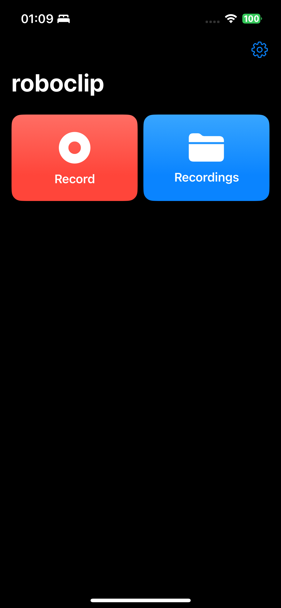

# roboclip

roboclip is an iOS app for recording synchronized LiDAR depth, RGB video, and IMU pose data, saving each session in a timestamped directory. It features a real-time AR preview, a modern SwiftUI interface, and robust background upload of recordings to Supabase Storage.

The home screen now shows an **Uploads** section beneath the record button that lists each session with its current progress.

## Features

- Real-time ARKit preview with LiDAR and RGB video
- Synchronized recording of video, depth (Float32), IMU data with gravity, and microphone audio
- Per-frame camera poses saved from the ARKit camera transform
- Optional capture of ARKit world map and environment mesh
- Each session saved in a timestamped Scan-* folder
- Modern SwiftUI UI: Home and Recording views
- Uploads new recordings to Supabase Storage with per-session progress tracking
- Uploads are robust, parallelized, retrying transient errors, and only count pending sessions
- Uploads kick off automatically when returning to the home screen or after a recording completes
- Completed uploads are automatically removed from local storage
- Settings view for cache clearing, app info, and debug tools

## File Structure

- `roboclip/RecordingManager.swift`: Handles video, depth, and IMU recording
- `roboclip/ARPreviewView.swift`: ARKit session and preview
- `roboclip/SupabaseUploader.swift`: Uploads sessions to Supabase
- `roboclip/HomeView.swift`: Main navigation and upload status
- `roboclip/SettingsView.swift`: App settings and developer tools
- `roboclip/SupabaseSecrets.xcconfig`: **Not committed** (see below)

## Supabase Setup

1. Create a project at [Supabase](https://supabase.com/)
2. Add your `SUPABASE_URL` and `SUPABASE_ANON_KEY` to `roboclip/SupabaseSecrets.xcconfig`
3. This file is ignored by git for security

## Building & Running

1. Open `roboclip.xcodeproj` in Xcode
2. Build and run on a LiDAR-capable iOS device (iPad Pro, iPhone 12 Pro or newer)
3. Record sessions, view them in the app, and upload to Supabase

## Security

- `roboclip/SupabaseSecrets.xcconfig` is in `.gitignore` and should never be committed
- Do not share your Supabase anon key publicly

## License

MIT License. See `LICENSE` file if present.

## Credits

Developed by James Ball and contributors.
